The kinds of games I wanna make on Elegy will occasionally feature relatively large (1.5 km × 1.5 km), sandboxy maps. Landmarks, vegetation, interactive objects, all kinds of things. But there would also be plenty of indoor sections. 

So, since 2021 (the inception of BurekTech X) I've thought about occlusion culling systems that could work either real-time or be baked, preferably utilising the GPU as much as possible, and scaling with level size and varying densities of detail.

This will be another pretty technical post, so prepare your imagination for this one! Yeah.

<!-- truncate -->

## Introduction

I am assuming you know a little bit about how computer graphics work. A triangle mesh is uploaded to the GPU, and then is subsequently rendered, multiple of them actually. The goal of occlusion culling is to be "picky" about what you're actually rendering.

If you're staring at a wall, you physically cannot see what's behind it, therefore it makes no sense to render anything behind it.

I'll be using terms like "PVS" and will coin a term I call "active visibility". There's probably already an industry term out there, but in either case, a PVS is a precomputed set of *potentially visible* items, a potentially visible set that is. These items may be chunks of a map, volumes, regions and so on. Spaces, generally.

Active visibility, on the other hand, is updated at runtime. Minimal pre-computation involved. This typically boils down to GPU-based methods, where information from the current or previous frame (e.g. the depth buffer) is used to determine visibility of objects before rendering them.

Between active and baked visibility, you are essentially making a bunch of different compromises:
* Static or dynamic environments
	* You're much more likely to use an active visibility solution in a procedural game, and a PVS when there are premade levels.
* Runtime cost
	* Naturally, if you go for an active visibility solution, it can have a higher runtime cost. Baked ones, if they're super simple to access, can perform faster.
* Baking cost
	* Goes without saying that active solutions have utmost minimal if not *any* cost when baking.

Ideally, it would be cool if I could have dynamic environments, no baking cost, and extremely little runtime cost. However, I'm pragmatic. I'm willing to have *mostly* static levels (albeit with lots of breakable things, and moving things), and a reasonable baking cost.

I had to define *two* primary aspects of the occlusion culling system:
* The spatial structure (BSP, convex hulls, octree, quadtree, whatever)
	* It would not only define the foundation for occlusion culling, but also spatial things like radius searches, possibly accelerate LOD logic, enable me to have distant parts of the map update less frequently and so on.
* The algorithm (raycasting on CPU/GPU, some weird intersections, whatever)
	* This simply defines how long I have to bake stuff, and how costly it would be at runtime, in terms of memory and filesize.

The two should be independent of each other, so I could experiment with different approaches later on.

## How we got here

The engines I've used for years (Quake, GoldSRC, Source) have used a baked PVS on a BSP tree, computed on the CPU. This is plain archaic. BSPs are *very* fragmentational by nature, and the Quake PVS scales very poorly the more portals you have.

So, various ideas were thrown around:

## Convex Hull PVS

In late 2021, I was thinking about the idea of automatically subdividing the level into a series of convex volumes, spawning portals from the touching boundaries of those volumes, and doing a little bit of traditional portal visibility testing, to bake a PVS.

Soon enough, I ran into a problem with that: the only convex hull decomposition library I knew (V-HACD) was not exactly giving me the results I wanted!

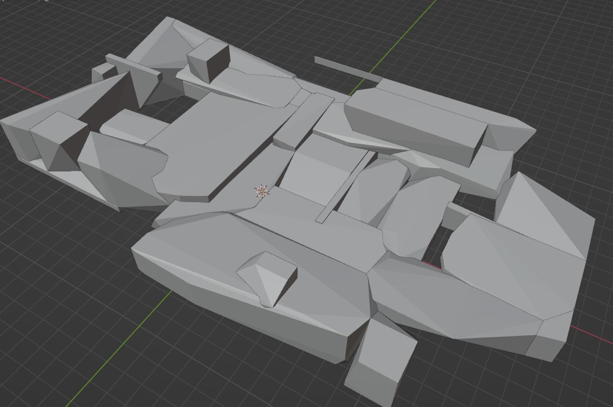

Meanwhile the original:

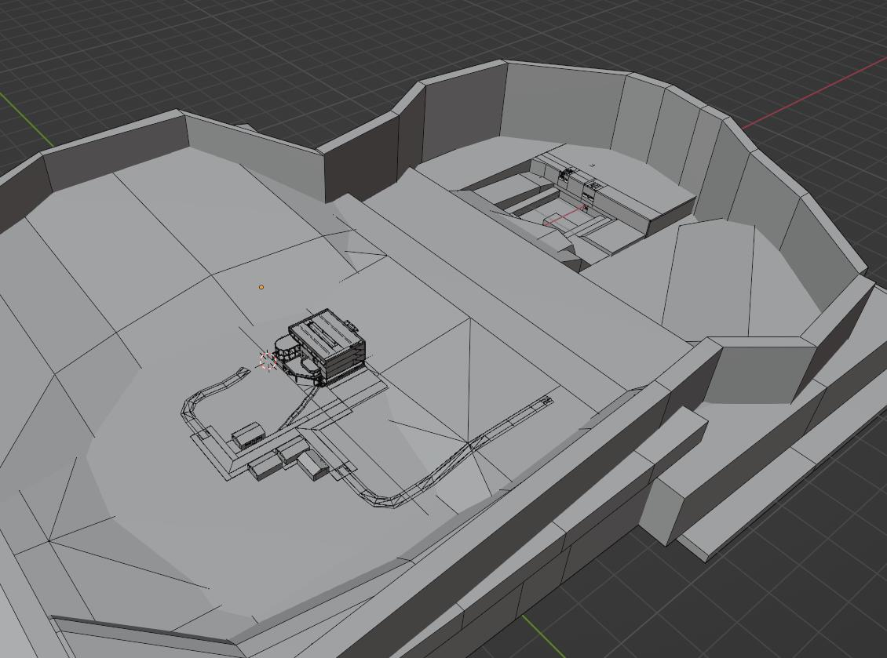

I knew a fair amount of other mathematical libraries too that operated in this domain, but V-HACD I could easily, immediately test, so this was quite disappointing. It seems these just don't work well with brushes.

## Convex Active Visibility

Eventually, I got dissatisfied with the portal logic too. I wanted to utilise the GPU in a simple and easy way. I decided to do the convex decomposition process manually via brushes, and I came up with a cool way to utilise the GPU, possibly even in real-time: 

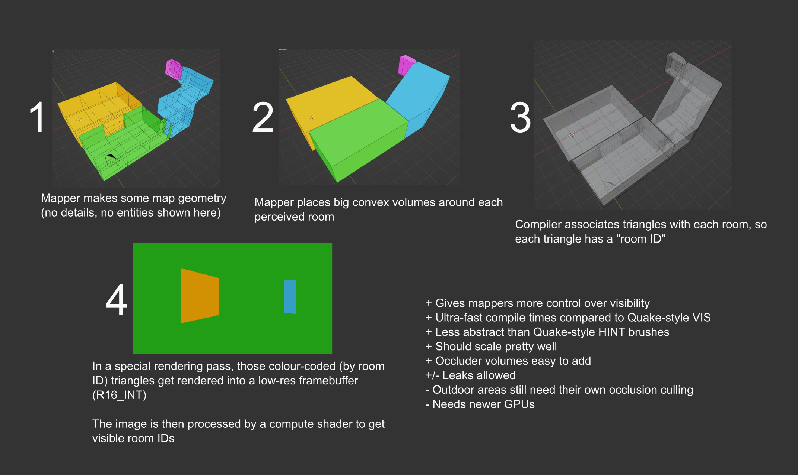
*August 2022, middle BurekTech X era*

I had a bit of trouble figuring out how this would then work in real-time. Am I just rendering the whole map over again? Yeah, that's not really scalable now, is it? I was also extremely unhappy with the whole manual aspect of it.

I wanted an *automatic* and *predictable* occlusion culling system, that performs super fast at runtime. I don't wanna delegate so much work to level designers.

I briefly experimented with an octree too:
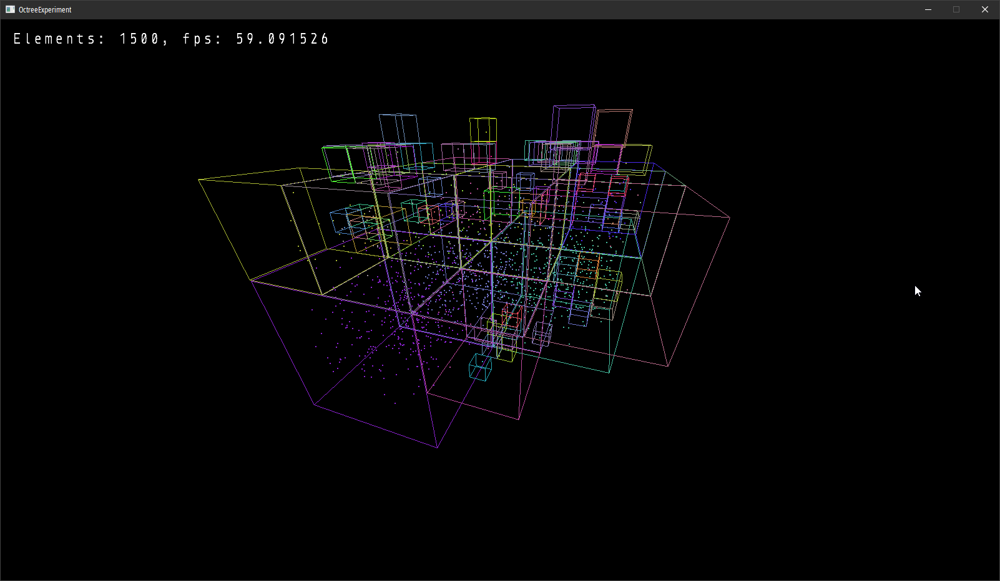
...but while it was a great start, I felt it was still not in the right direction.

## Dual Grid Active Visibility

I ended up going for a grid. That's right. A grid.

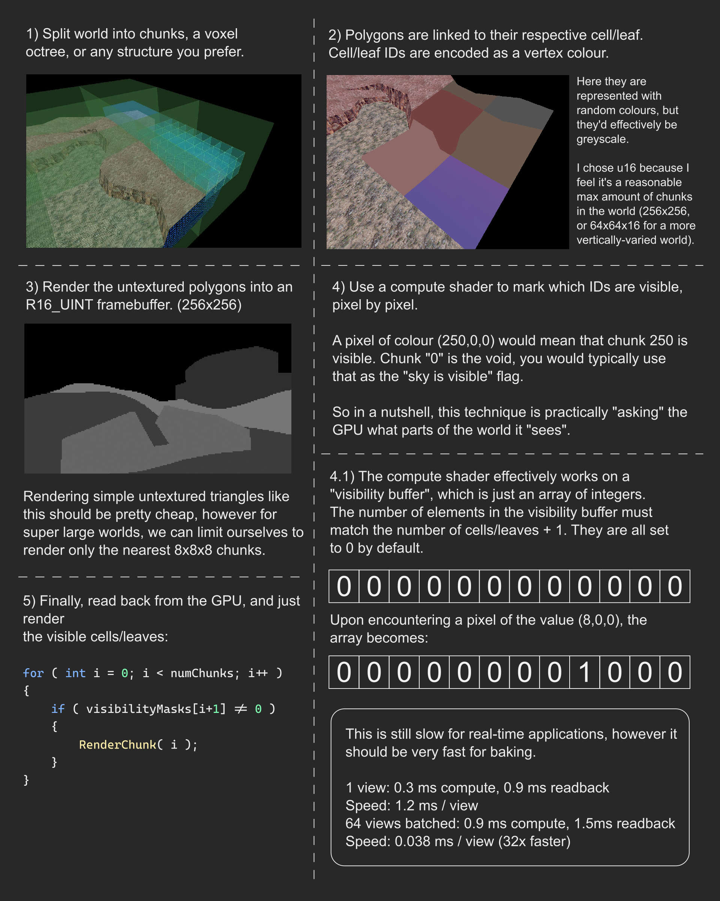
*August 2023, early Elegy era*  
*Note: the readback times are massively off, they're actually closer to 10 milliseconds.*

You may see quite a few parallels between this illustration and the last one. It still uses rasterisation to determine visibility, and each visibility node is essentially a mesh with a "colour-coded" ID, for illustration purposes.

The main issue right then was: it could potentially work fine with a single view, but what happens with stereo rendering, or multiple cameras that render to a screen? It would not scale well at runtime.

That brings us to the final form.

## Dual Grid PVS

Finally. The actual occlusion culling algorithm, and spatial partitioning scheme in Elegy. At least for now! I'm going to discuss it here in detail.

First, the advantages over previous approaches:
* The simplest to implement so far.
* The smallest runtime cost so far.
* Scales best so far: O(1) at runtime, O(n) at bake-time.

Basically, all you do is this:
```cs
var chunk = grid.GetChunk( playerPosition );
var visibleChunkIds = chunk.GetVisibleFrom( playerPosition );

// Current chunk first to take advantage of early Z,
// then neighbouring chunks
Render( chunk.Id, visibleChunkIds );
```

And second, disadvantages:
* Takes up the most filesize and memory so far.
	* But even then, it's small. Read below!
* Very tricky to implement toggleable occluders.
	* Although, I honestly don't really need these.

I am perfectly fine with these pros & cons, if you ask me. So how does it work?

## Dual Grid

Essentially, there is a large grid that spans the entire map. It's pretty coarse, too, for example one cell can be 10^3 metres.

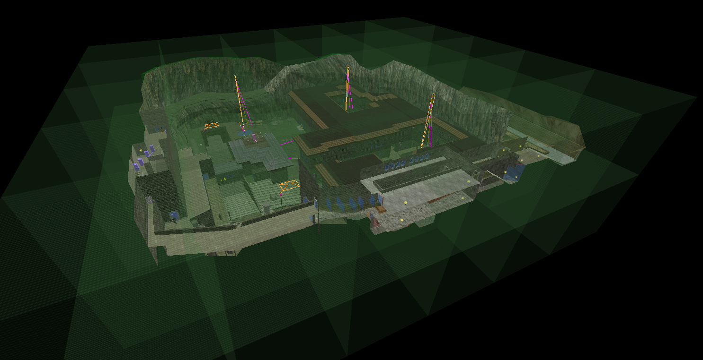
*My Sven Co-op map de_kobbl, from 2018*

One such grid cell is called a **chunk**. Chunks, inside of them, have smaller, more fine grids. Their fine cells, **subchunks** or **chunklets**, may be 1^3 metres.

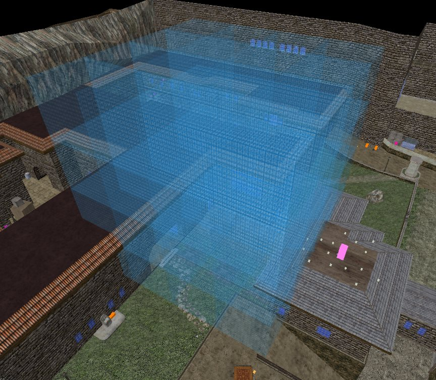
*No blue box is equal here, though they do see a lot of similar chunks of the map.*

Chunks contain a list of neighbouring chunks that are *potentially* visible. It may typically be very small, 4 to 32.

Chunklets contain information about which *of those* neighbouring chunks are visible. Chunks express coarse visibility, chunklets express *fine* visibility for a particular location within a chunk.

### Filesize and memory

They are compressed into bit lists, so for example, a chunk that can see 8 other chunks would look like this:
```
0110 1101 0110 1011 0001 1001 1010 1010 // and so on
```

The first 2 bytes, `0110 1101` indicate that neighbours 2, 3, 5, 6 and 8 are visible, whilst neighbours 1, 4 and 7 are not.

If the chunk potentially saw only up to 3 neighbours, then this bit list would be a whole lot shorter:
```
011 100 101 100 111 111 000 // and so on
```

Let's try to imagine the resulting filesize of a real-world-ish scenario. A 1km^2 map, with some 500 metres of verticality, a chunk size of 50 metres, and a chunklet size such that it results in 8^3 chunklets per chunk (6.25 metres). Let's also say a chunk may - on average - see 8 other chunks, giving us an average view distance of 250 metres. In reality, some areas will see up to 50 metres, others may really see up to a kilometre, and a ton of chunks as such. But anyway!

This will result in a grid of 20x20x10 chunks, and a total of 2 million chunklets at 1 byte per chunklet. And you know what? This is not even bad - a mere 2 megabytes for a kilometre-wide map. I was expecting fifty!

Chunks can have different chunklet densities too, depending on the geometric complexity inside! As such, chunks that are entirely up in the air/sky, they will have just a couple chunklets.

### Spatial partitioning

For simplicity, here's a cross-section of a map:
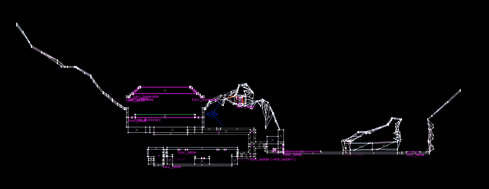

A top-level grid is made:
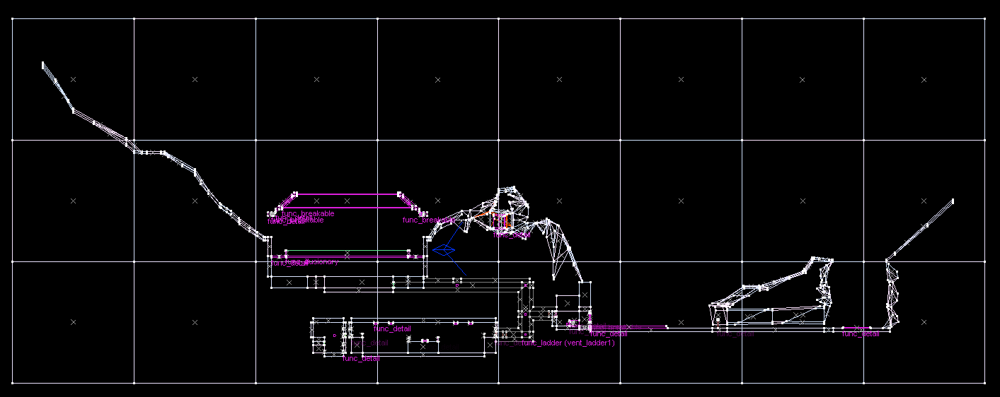

Notice how the leftmost chunk has a teeny tiny little bit of geometry in a corner, but is mostly empty. It's a bit of an inefficiency, isn't it?

It is possible for chunks to "steal" geometry from their neighbours, if said neighbour 1) has extremely little geometry inside (e.g. less than 5%) and 2) the geometry is extremely close to the border anyway.

Also, in case there's a really large polygon spanning two or more chunks, it can get subdivided among them, to maintain consistency on the grid.

Finally, with all the chunklets:


## Rasterised Visibility Buffer

Now we get to the algorithm. Specifically, the algorithm that bakes all this information.

The idea is fundamentally just these 3 steps:
1. Associate each polygon with its respective room
2. Render the map with such encoded polygons from a given POV
3. Determine visibility data for that POV

But wait, how do we get this to work with chunks and chunklets?

My initial approach was spawning 6 cameras at the centre of each chunklet, capturing what is essentially a "visibility cube". This immediately has a ton of edge cases though:
* what if the centre of the chunklet is right underneath the floor?
* it won't reliably capture all POVs within that chunklet

So, I decided to reinforce it by spamming 3x3 cameras (or more, depending on your baking quality settings!) all over the chunklets. Let's refer to them as **visibility probes**, probes for short.

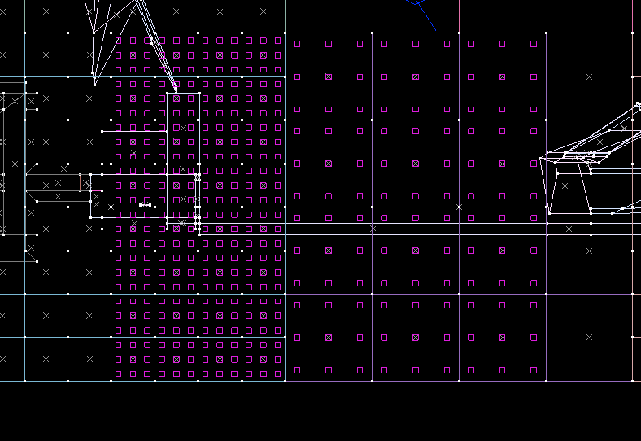

Immediately, we see that there's a bunch of probes under the floor. These can be removed by checking for nearby geometry, and determining if the camera is facing the backside of a number of polygons. It can be done with a little bit of raycasting.

Additionally, probes could be nudged a little bit upwards, so that they are not super close to the floor or walls.

We end up with:

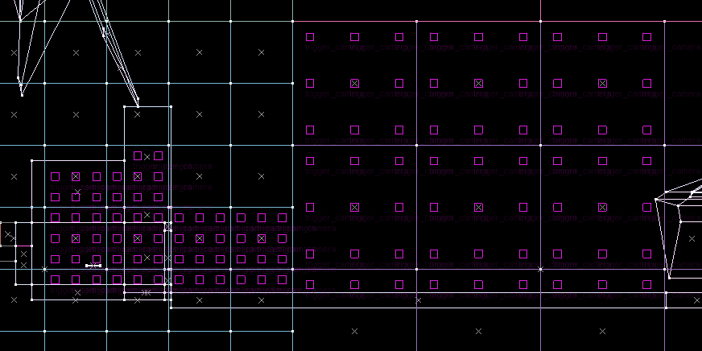

### Computation

1. Create a high-resolution "visibility buffer" texture, `R16_INT` format.
	* This is enough to store 65k potentially visible chunks.
2. For each chunklet, render the probes and compute visibility:
	1. Populate the visibility buffer.
		* This means, one probe will render six views at 128x128 resolution, into the visibility buffer. Essentially making it an atlas.
	2. Create a list of visible chunk IDs.
	3. Dispatch a compute shader to populate the above list.
		* It may be as simple as `list[currentPixel.r] = 1`.
	4. Pass this data onto this chunklet's chunk.
		* The chunk will then accumulate and merge results.
	5. Clear the visibility buffer.
3. For each chunk, compress visibility data:
	1. Utilise the above-mentioned results to create bitfields in each chunklet, encoding visible neighbouring chunks as bits. This has been outlined previously in [Filesize and memory](#filesize-and-memory).

### Memory and performance

If a chunk contains 512 chunklets, and if on average 50% of the probes inside are discarded, then we're left with 512×50%×3^3 probes. About 7000. Since this is effectively a cubemap of views, that would mean we need to render about 7000×6 = 42'000 views. Or 162 views per chunklet.

That many views (42k) at 128x128 could easily fit into a dozen 8K textures. You may be concerned about video memory there, but keep in mind, this is an `R16_INT` buffer! You can go up to 65k chunks with that. :)

A dozen 8K textures in that format is basically 1.3 GB of video memory, which is a significant portion of my card's 12 GB, but still a comparatively small one. And that is the cost for an entire chunk. A chunklet is a lot less than that.

Still, it sounds like *a lot* to render, but remember, these views are low-res, there is extremely little data to pass to the shader, and the geometry can be batched embarrassingly well. You can trivially render the whole thing with one drawcall.

Another thing that can optimise all this is the `multiview` extension, where you render into multiple targets simultaneously. It can be utilised to render probes from multiple chunklets simultaneously, or to render multiple chunks simultaneously.

We will see some actual numbers once this is implemented in the map compiler.

## Future work

Out of personal curiosity, I did some guesswork still. My PC (RTX 3060, i5 8400, 16 GB of RAM) should be easily able to render a 50k-triangle level at 1500 frames per second. Without `multiview` optimisations et cetera, this means it would take 28 seconds to render 42k views.

Multiply that by 50 chunks and you get about 23 minutes. Add another 50% to that of computation time and other tasks, and that's half an hour. Yikes.

Other than optimising everything (I am hoping to see 2x to 4x performance improvements there), I am also looking into the ability of *detaching* PVS baking. For example, if you make a minor change to the map that won't affect visibility, it doesn't need to be recomputed.

It may be possible to investigate *incremental* baking too, which would be of tremendous help. In essence, it could just rebake chunks whose occluding geometry was modified.

It would also be possible to "inject" visibility probes as a level designer, in case the automatic probing process manages to miss out on some details.

Lastly, this can evolve into a dual grid hierarchy too, to have sparse chunks for outside areas and denser chunks for inside areas. However, this will only get considered in future milestones.

## Active visibility version

Now, if you have more graphics programming experience, you may have made quite an observation: this whole algorithm could still get moved into active visibility territory, if only I changed, well, how the renderer works.

As-is, in the engine's renderer, the CPU loops through all visible and renderable entities, and generates drawcalls for them. Couldn't we make this entire thing GPU-driven? Sure we could. We very well could. 

Truth be told though, I've never done indirect rendering like that, and I don't *yet* see much need to have it in my projects. It's an idea for a later version of Elegy, perhaps. We'd eliminate visibility baking entirely, though the spatial partitioning stuff would still remain, as it's useful beyond just rendering.

## The end

Thank you for reading! This was quite the writeup.
