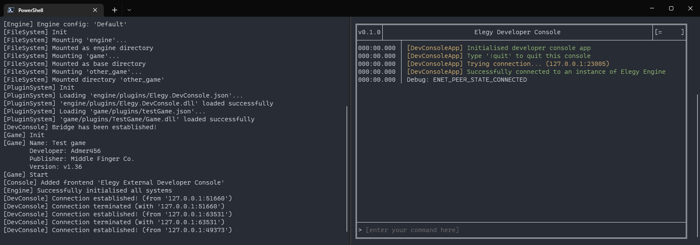

# DevConsole bridge plugin

This is a plugin for Elegy which essentially maintains connections with external developer consoles/terminals.

An example external console is [DevConsoleApp](https://github.com/ElegyEngine/ElegyDevConsoleApp).

Here's what this plugin allows you to have (and its current state of things):

*Left: Elegy standard output, right: DevConsoleApp*

Note that this is absolutely **not finished**. Check back in Q3 2023. Missing features include:
* displaying the actual console messages from the engine
* executing CVars and console commands
* autocompletion
